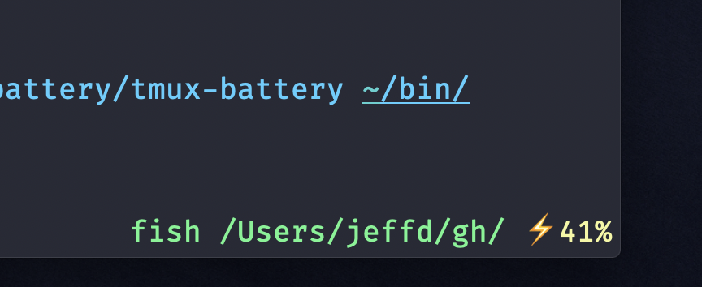

tmux-battery
============

Shows battery charge level inside tmux status. macOS only.



Installation
============

Add the following to `~/.tmux.conf`

```
set -g status-right '#(/path/to/tmux-battery)'
```
